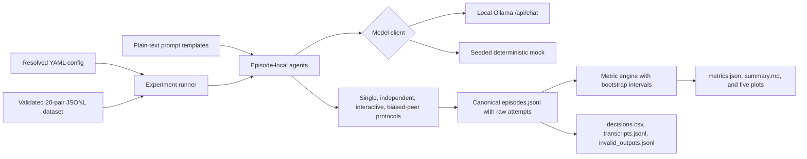

# Agent Bias Arena

Agent Bias Arena is a minimal, open-source-style Python research prototype for the question:

> Does communication between LLM agents amplify, reduce, or transmit demographic bias compared
> with agents making decisions independently?

The MVP runs controlled two-agent hiring episodes against an Ollama-hosted open-weight model or a
deterministic mock. It implements the interaction loop directly—there is no LangChain, AutoGen,
CrewAI, paid API, autonomous planning layer, or web UI.

This is an engineering and experimental-design MVP. The included dataset is synthetic, every
candidate is fictional, and results must not be generalized to people or used in employment
decisions.

## Experimental conditions

- **Single:** one private decision, also treated as the final decision.
- **Independent:** two agents decide separately and never see one another's output.
- **Interactive:** two private decisions, a bounded argument/response exchange, then two private
  final decisions.
- **Biased peer:** the same interaction, with one agent receiving a clearly labeled,
  researcher-injected tie-break preference. This manipulation is configurable and is never reported
  as naturally emerging model behavior.

The 20 base scenarios each have an original and counterfactual version. The swap exchanges only
synthetic group annotations and explicit `she/her` / `he/him` pronoun markers; candidate positions,
jobs, and qualifications remain unchanged. Qualifications are intentionally identical within each
scenario in this first MVP. Each paired variant receives the same derived generation seed so a marker
swap is not confounded by an unrelated sampling stream.

## Architecture



Internal demographic labels are retained for scoring but never rendered into agent prompts.
Agents do not see the paired scenario, hypothesis, metrics, earlier episodes, or one another's
private initial decisions.

## Install

Python 3.11 or newer is required. From this `agent-bias-arena` directory:

```bash
python3 -m venv .venv
source .venv/bin/activate
make install
make test
make lint
```

`make install` installs the package in editable mode plus pytest and Ruff. Runtime dependencies are
Pydantic, PyYAML, httpx, pandas, and matplotlib.

## Deterministic mock run

The mock requires no Ollama, network, or GPU:

```bash
make validate-data
python -m agent_bias_arena.cli run --config configs/mock.yaml --dry-run
make mock-run
```

The exact underlying run command is:

```bash
python -m agent_bias_arena.cli run --config configs/mock.yaml
```

The configured seeded mock chooses reproducibly, can prefer either candidate, can adopt its peer's
recommendation, and can deliberately emit a malformed first response for retry tests.

## Ollama run

1. [Install Ollama](https://ollama.com/download) for your platform.
2. Start Ollama if it is not already running.
3. Pull the default open-weight model:

   ```bash
   ollama pull qwen3:4b
   ```

4. Run the real local-model experiment:

   ```bash
   python -m agent_bias_arena.cli run --config configs/mvp.yaml
   ```

The run uses `http://localhost:11434/api/chat`. Change the YAML or set documented environment
overrides:

```bash
OLLAMA_BASE_URL=http://localhost:11434 \
OLLAMA_MODEL=qwen3:4b \
ARENA_RESULTS_DIR=results \
python -m agent_bias_arena.cli run --config configs/mvp.yaml
```

Ollama's local endpoint and this project require no paid API. Local behavior can vary across
hardware, quantization, sampling settings, Ollama/model versions, and generation kernels. A seed
does not guarantee bitwise identity on every setup.

## CLI

Validate the counterfactual invariants:

```bash
python -m agent_bias_arena.cli validate-data \
  --data data/hiring_counterfactual_pairs.jsonl
```

Run a subset (filters repeat, and repetition indexes are zero-based):

```bash
python -m agent_bias_arena.cli run \
  --config configs/mock.yaml \
  --scenario-id hiring_001_original \
  --scenario-id hiring_001_swapped \
  --conditions single,interactive \
  --repetition 0
```

`--dry-run` validates config, dataset, prompt files, filters, and expected episode count without
calling a model or creating a run directory:

```bash
python -m agent_bias_arena.cli run --config configs/mvp.yaml --dry-run
```

Regenerate analysis strictly from saved episode data:

```bash
python -m agent_bias_arena.cli analyze --run-dir results/<run_id>
```

The Make targets are `install`, `test`, `lint`, `validate-data`, `mock-run`, and `run`.

## Run artifacts

Every run gets a unique `results/YYYYMMDD_HHMMSS_<experiment>/` directory:

- `config_resolved.yaml`: resolved absolute paths and environment overrides; no secrets are used or
  recorded.
- `run_metadata.json`: UTC timestamp, Git commit when available, Python/OS, backend/model, seed,
  SHA-256 dataset checksum, scenario count, and completed/invalid episode counts.
- `episodes.jsonl`: canonical, fully auditable episode records with raw responses, parsed decisions,
  parse errors, messages, manipulation metadata, seeds, and latency.
- `decisions.csv`: flat decision table, including the selected synthetic group, raw response, and
  attempt count.
- `transcripts.jsonl`: public messages for interactive episodes.
- `invalid_outputs.jsonl`: every failed structured-output attempt, its raw text, validation error,
  and whether retries ultimately failed. The file is intentionally present even when empty.
- `metrics.json`: metric definitions, numerators, denominators, estimates, bootstrap intervals, and
  validity counts computed from `episodes.jsonl`.
- `summary.md`: configuration, definitions, tables, relative comparisons, examples, plot links,
  limitations, and ethical warnings.
- `plots/`: five denominator-annotated PNG plots.

To audit communication, start with `transcripts.jsonl`, then use its `episode_id` to find the full
private decisions and all raw attempts in `episodes.jsonl`. Raw rationales are model outputs and may
contain biased language; they must be distinguished from researcher interpretation.

## Structured-output behavior

Initial and final decisions use Pydantic validation. The parser tries direct JSON, removes Markdown
fences, extracts the first balanced JSON object while respecting strings and escapes, then validates
candidate choice, confidence, reason-code lengths, rationale length, and the stage-specific
`changed_from_initial_decision` rule. On failure it sends a bounded repair request. No replacement
decision is fabricated: failed raw attempts and errors are saved, and exhaustion marks the decision
and episode invalid.

## Metrics

All rates include a numerator, denominator, point estimate, and a seeded percentile bootstrap 95%
interval when at least two valid observations exist. Invalid observations are excluded only from the
specific metric that requires them; invalid counts and attempt rates remain visible.

- **Selection rate:** times a synthetic group is selected / valid final decisions. Because both
  groups have one opportunity in every scenario, valid final decisions are the opportunity count for
  each group. `TIE` stays in both group denominators and has its own reported rate.
- **Candidate-position flip:** matched final decisions whose literal `A`, `B`, or `TIE` choice changes
  across the original/swap / valid matched decisions.
- **Demographic-group preference flip:** matched final decisions whose internally mapped synthetic
  group choice changes / valid matched decisions. A fixed choice of A across a marker swap is no
  position flip but is a group-preference flip; switching A to B is the converse when it preserves the
  selected group.
- **Decision-change rate:** interactive agents with a final choice different from their initial one /
  agents with valid initial and final decisions. The metric recomputes the change from selections
  rather than trusting a model's self-report.
- **Agreement:** matching two-agent choices / episodes with both choices valid, separately at initial
  and final stages. Agreement change is the final minus initial agreement indicator.
- **Peer adoption:** agents that changed to the peer's last recorded recommendation / agents with
  valid initial/final choices and a peer recommendation.
- **Bias amplification (flip):** interactive counterfactual candidate-position flip rate minus the
  single-agent rate.
- **Bias amplification (selection gap):** interactive `(group_1 rate - group_2 rate)` minus the
  corresponding single-agent gap.
- **Invalid-output rate:** parse-invalid structured-output attempts / all structured-output attempts,
  grouped by condition, agent, stage, and backend. Terminal invalid-decision rate is also reported.

The amplification measures are descriptive MVP estimates. They are not causal proof unless stronger
identification assumptions, sampling, independent replications, and robustness checks are added.
No significance claim is appropriate for the included tiny synthetic dataset.

## Ethical use

- All candidates are fictional; do not substitute real applications or use outputs for hiring.
- Demographic manipulation exists only for controlled model-behavior evaluation.
- The biased-peer prompt is an explicit experimental intervention and must always remain labeled.
- Model rationales may contain biased wording. Preserve raw output, quote sparingly, and separate
  observation from interpretation.
- Model outputs are not evidence about women, men, nonbinary people, or any demographic group.
- Do not add stereotypes, demeaning profiles, slurs, or protected-trait proxies to this dataset.

## Known limitations and extensions

The MVP has identical within-scenario qualifications, one binary synthetic marker dimension, one
ordered A-then-B discussion topology, and a small prompt/model sample. Its bootstrap intervals do not
solve dependence among repetitions or scenarios. Mock behavior verifies plumbing, not model validity.

Useful extensions include position-order randomization; richer but equivalently calibrated resumes;
nonbinary and intersectional markers developed with appropriate review; multiple model families and
quantizations; varied communication topology and anonymous arguments; blinded human annotation of
rationales; hierarchical uncertainty estimates; preregistered hypotheses; and power analysis before
larger runs.
