# Daily Market Intelligence Report

Generated: 2026-07-02T07:32:29.268612-04:00

## 1. Executive summary

Treasury yield changes are not unusually large in the available data. Market data was collected for 16 watchlist assets, with 0 missing snapshots. Stage 1 emphasizes anomaly detection and reliable labeling of unavailable data. Source-linked company and macro news analysis will be added in Stage 2.

## 2. Top developments

- **MSFT**: Large daily move: 3.0%. Importance 65. Market reaction: daily 3.02%, five-day 5.15%. Source: yfinance.
- **PLTR**: Large daily move: 7.8%. Importance 65. Market reaction: daily 7.77%, five-day 10.78%. Source: yfinance.
- **META**: Large daily move: 8.8%. Importance 65. Market reaction: daily 8.81%, five-day 9.91%. Source: yfinance.
- **SPCX**: Large daily move: -7.8%. Importance 65. Market reaction: daily -7.80%, five-day 1.94%. Source: yfinance.
- **TSLA**: No major price anomaly in available market data. Importance 30. Market reaction: daily 1.12%, five-day 13.25%. Source: yfinance.
- **Treasuries**: Treasury yield changes are not unusually large in the available data. Source: https://home.treasury.gov/resource-center/data-chart-center/interest-rates/pages/xml?data=daily_treasury_yield_curve&field_tdr_date_value=2026.

## 3. Watchlist dashboard

| Asset | Latest value | Daily change | Five-day change | YTD change | Main development | Importance |
| ----- | -----------: | -----------: | --------------: | ---------: | ---------------- | ---------: |
| TSLA (equity) | $425.30 | 1.12% | 13.25% | -2.92% | No major price anomaly in available market data [yfinance_daily] | 30 |
| AMZN (equity) | $241.70 | 1.41% | 3.17% | 6.71% | No major price anomaly in available market data [yfinance_daily] | 30 |
| MSFT (equity) | $384.28 | 3.02% | 5.15% | -18.75% | Large daily move: 3.0% [yfinance_daily] | 65 |
| GOOG (equity) | $357.89 | 1.29% | 3.72% | 13.50% | No major price anomaly in available market data [yfinance_daily] | 30 |
| PLTR (equity) | $125.73 | 7.77% | 10.78% | -25.10% | Large daily move: 7.8% [yfinance_daily] | 65 |
| NVDA (equity) | $197.58 | -1.25% | -0.71% | 4.62% | No major price anomaly in available market data [yfinance_daily] | 30 |
| BX (equity) | $119.55 | 1.60% | 5.81% | -24.72% | No major price anomaly in available market data [yfinance_daily] | 30 |
| META (equity) | $612.91 | 8.81% | 9.91% | -5.77% | Large daily move: 8.8% [yfinance_daily] | 65 |
| IBIT (equity) | $34.00 | 2.13% | 0.38% | -33.25% | No major price anomaly in available market data [yfinance_daily] | 30 |
| SPCX (etf) | $157.54 | -7.80% | 1.94% | -2.12% | Large daily move: -7.8% [yfinance_daily] | 65 |
| IAU (etf) | $75.96 | 0.60% | 1.29% | -6.87% | No major price anomaly in available market data [yfinance_daily] | 30 |
| VOO (etf) | $685.46 | -0.20% | 1.45% | 9.10% | No major price anomaly in available market data [yfinance_daily] | 30 |
| AGG (etf) | $98.50 | -0.48% | -0.70% | -1.35% | No major price anomaly in available market data [yfinance_daily] | 30 |
| VBTLX (mutual_fund) | $9.63 | -0.21% | -0.41% | -1.33% | No major price anomaly in available market data [nav_prior_day] | 30 |
| SWPPX (mutual_fund) | $19.32 | 0.00% | 1.90% | 9.96% | No major price anomaly in available market data [nav_prior_day] | 30 |
| TCIEX (mutual_fund) | $30.66 | 0.00% | 1.69% | 8.96% | No major price anomaly in available market data [nav_prior_day] | 30 |

## 4. YTD charts

### TSLA - Tesla

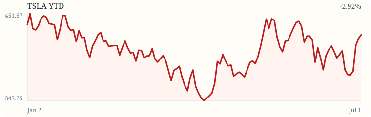

### AMZN - Amazon

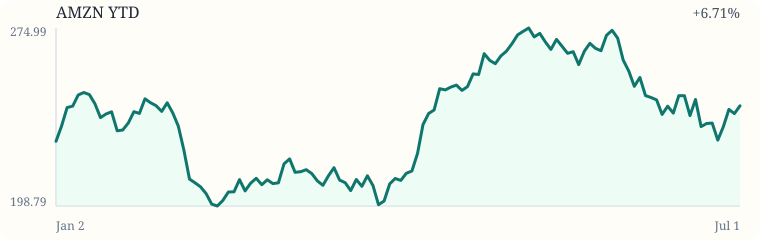

### MSFT - Microsoft

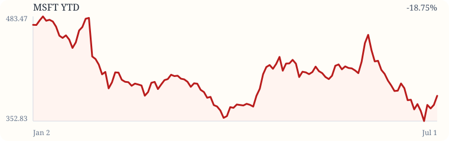

### GOOG - Alphabet Class C

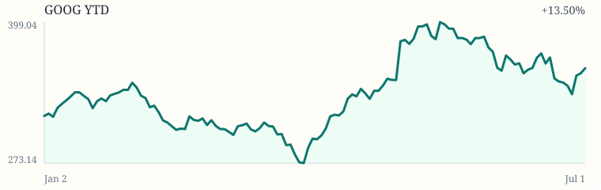

### PLTR - Palantir

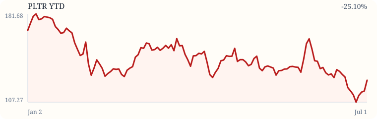

### NVDA - NVIDIA

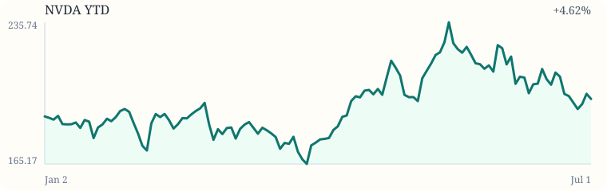

### BX - Blackstone

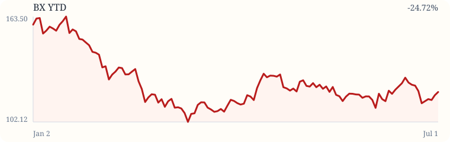

### META - Meta Platforms

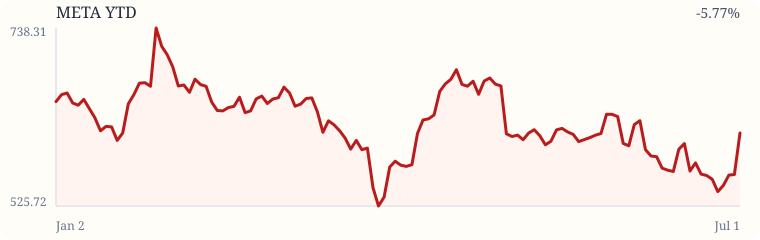

### IBIT - iShares Bitcoin Trust ETF

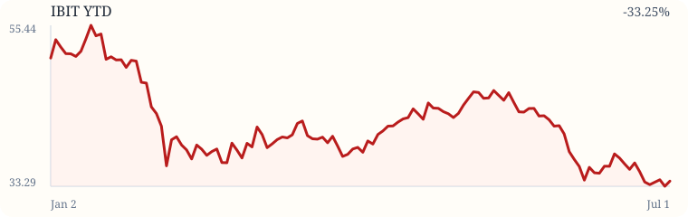

### SPCX - SPAC and New Issue ETF

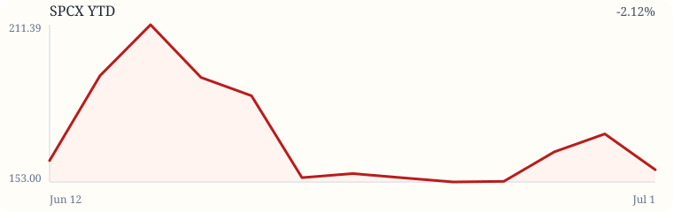

### IAU - iShares Gold Trust

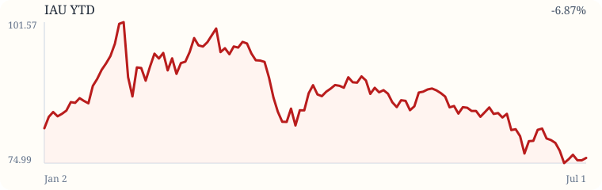

### VOO - Vanguard S&P 500 ETF

### AGG - iShares Core U.S. Aggregate Bond ETF

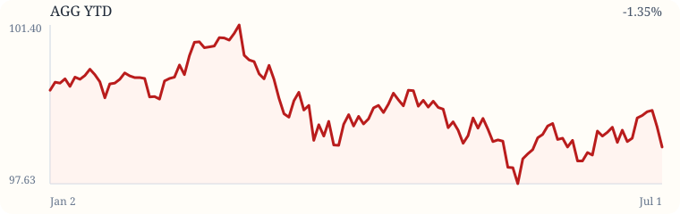

## 5. Company-by-company analysis

Stage 1 includes company sections only when price or volume anomalies are visible from market data.

### MSFT - Microsoft

- Most important new event: Large daily move: 3.0%.
- Fundamental significance: requires Stage 2 news and filing collection.
- Short-term market significance: price/volume anomaly flagged from available data.
- Risks: market data can be delayed and does not explain causality by itself.
- Counterarguments: moves may reflect broad market or sector factors.
- What to watch next: confirm with primary sources, filings, and authoritative news.

### PLTR - Palantir

- Most important new event: Large daily move: 7.8%.
- Fundamental significance: requires Stage 2 news and filing collection.
- Short-term market significance: price/volume anomaly flagged from available data.
- Risks: market data can be delayed and does not explain causality by itself.
- Counterarguments: moves may reflect broad market or sector factors.
- What to watch next: confirm with primary sources, filings, and authoritative news.

### META - Meta Platforms

- Most important new event: Large daily move: 8.8%.
- Fundamental significance: requires Stage 2 news and filing collection.
- Short-term market significance: price/volume anomaly flagged from available data.
- Risks: market data can be delayed and does not explain causality by itself.
- Counterarguments: moves may reflect broad market or sector factors.
- What to watch next: confirm with primary sources, filings, and authoritative news.

## 6. ETF and mutual-fund analysis

VOO and SWPPX provide overlapping S&P 500 exposure. AGG and VBTLX provide overlapping broad U.S. bond-market exposure. Mutual fund values are labeled as NAV/prior-day when configured as NAV-only.

## 7. Treasury and bond-market analysis

| Tenor | Yield | Daily bp change |
| ----- | ----: | --------------: |
| 2Y | 4.17% | 3.0 bp |
| 5Y | 4.24% | 5.0 bp |
| 10Y | 4.48% | 4.0 bp |
| 30Y | 4.97% | 6.0 bp |

2s10s spread: 31.0 bp. 10s30s spread: 49.0 bp.
Implications: higher yields can weigh on long-duration growth stocks and bond-fund prices; lower yields can do the reverse, depending on credit spreads and duration.

## 8. Cross-asset signals

Higher long-term Treasury yields can pressure long-duration growth equities, including AI and technology names. Lower yields can support valuation multiples while affecting bond funds through duration exposure. Gold exposure through IAU can react to real yields, inflation expectations, the U.S. dollar, and geopolitical risk. BX and SPCX can be sensitive to credit conditions, capital-market activity, IPO windows, and speculative risk appetite.

## 9. Upcoming catalysts

Stage 1 does not yet collect forward calendars. Stage 3 will add earnings, macro releases, Treasury auctions, Fed meetings, and fund distributions.

## 10. Risks and anomalies

- TCIEX: identity, asset class, and benchmark require verification

## 11. Bottom line

- MSFT: Large daily move: 3.0%. Next catalyst: verify with news, filings, and scheduled events in later stages.
- PLTR: Large daily move: 7.8%. Next catalyst: verify with news, filings, and scheduled events in later stages.
- META: Large daily move: 8.8%. Next catalyst: verify with news, filings, and scheduled events in later stages.
